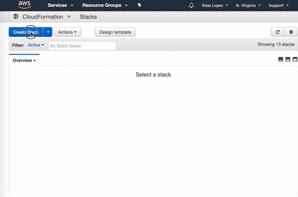

# SNS SMS Limit Spending Alert

After repeatedly been biten by this, I decided to investigate how to create a solution for alerting my accounts when I am close to the Maximum Spending Limit I have authorize in SNS for SMS, which can vary [depending on the destination country of the recipient's phone number](https://aws.amazon.com/sns/sms-pricing/) you are sending and can easily deplete your default monthly quota.

Using the AWS CLI this is easy:

* Create a SNS Topic 
* Subscribe an email
* Confirm the email
* Create an alarm that notifies the topic when the SMSMonthToDateSpentUSD metric of the AWS/SNS Namespace surpasses your desider spending limit.
* Profit!

I think is easier to just have a Cloudformation template to do this, which the template in the CFN folder does.

###To launch the stack:

1. Go to the [Cloudformation console](https://console.aws.amazon.com/cloudformation)
2. Click on "Create Stack"
3. Click on "Upload a template to Amazon S3" and select the template you have previously downloaded from this repo.
4. Click on "Next" and provide a Stack Name
5. Provide a value for Account Name or leave the default. This is used for the email notification you will receive so you know which account this alarm is referring to.
6. Provide a numerical value for MaxMonthlyExpenseInDollars. This is the amount that will trigger the alarm, letting you know that you have surpassed the limit and allowing you to know if your SMS messages will start to fail from then on, or simly set a lower value to let you know in advance when you are approaching the limit.
7. Provide a value for "Recipient email address". This value will be the email that will be notified when the alarm triggers. It has to be a valid email and you will also need to confirm the subscription once the stack launches.
8. Click on next. There are not specific options you need to set but you may fill out Tags and specific permissions to this stack. It is your call.
9. Click on next. Review the details that will be used to launch the stack. Click on "Create" at the end of the page to launch the stack
10. Once the stack completes, you should confirm the email subscription and from then on you will be alerted when the SMSMonthToDateSpentUSD metric surpasses your specified value.

You will need to do this on every region you expect to use to send SMS, and that's it!